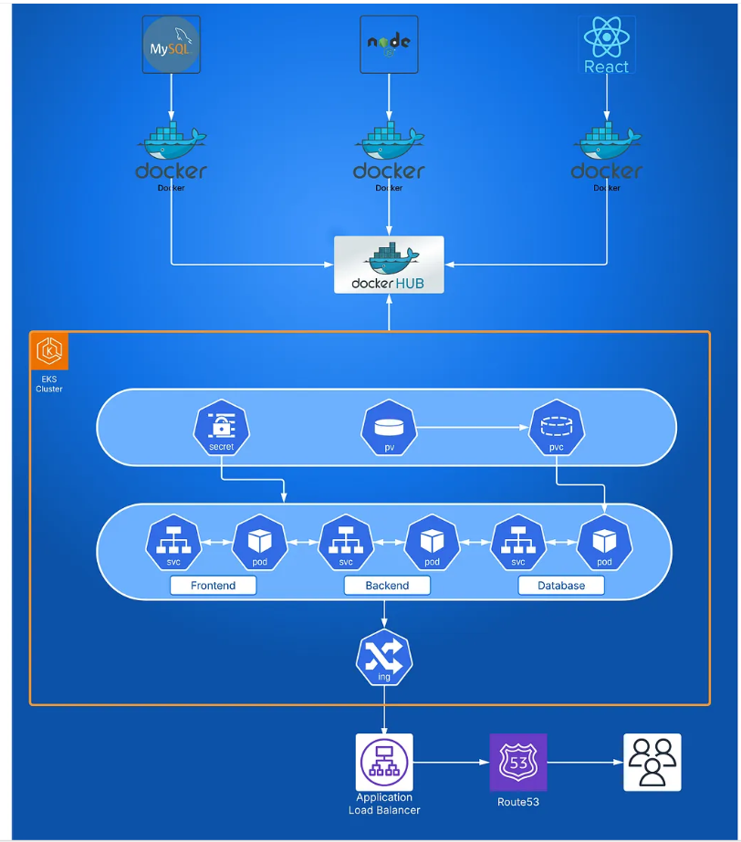

# 📦 Three-Tier Application Deployment on Kubernetes (EKS)

This project demonstrates the deployment of a fully functional **three-tier application** — comprising a **frontend**, **backend**, and **database** — on an **Amazon EKS (Elastic Kubernetes Service)** cluster.

---

##  Overview

Deploying a three-tier application on Kubernetes may seem complex, but with a strong grasp of core concepts, it becomes much more approachable.

This project guides you through:

-  **Containerizing applications** using Docker
-  **Writing Kubernetes manifests from scratch**
-  Establishing **communication between tiers** (frontend ↔ backend ↔ database)
-  **Deploying to EKS** for scalability and high availability

---

## 📁 Project Structure

├── frontend/
│ └── Dockerfile, deployment.yaml, service.yaml
├── backend/
│ └── Dockerfile, deployment.yaml, service.yaml
├── database/
│ └── deployment.yaml, service.yaml
├── manifests/
│ └── namespace.yaml, configmap.yaml, secrets.yaml

---

## 🎯 Key Features

- Containerized architecture using Docker
- Kubernetes manifests written from scratch
- Hosted on Amazon EKS for production-grade orchestration
- Full CRUD functionality (store, retrieve, delete data)
- Secure communication between app layers

---

## 🛠️ Technologies Used

- **Docker**
- **Kubernetes**
- **Amazon EKS**
- **YAML (for K8s manifests)**
- **AWS CLI / kubectl**

---

##  What I Learned

- Simplifying complex infrastructure by understanding Kubernetes fundamentals
- Enabling multi-tier communication inside a Kubernetes cluster
- Managing application state across stateless containers
- Deploying to cloud-native infrastructure using best practices

---

## 📌 Future Improvements

- Add Helm charts for easier deployments
- Integrate CI/CD using GitHub Actions
- Implement auto-scaling and monitoring with Prometheus/Grafana

